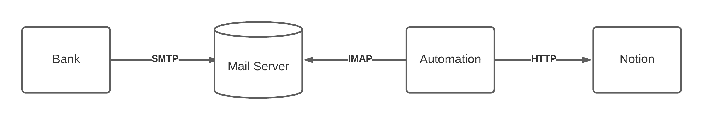

# 🚀 Automate Payment E-mails to Notion

This project aims to collect all bank outbound transactions that notify from e-mails with IMAP protocol since most of the banks doesn't provide public API to retrieve transactions in real-time manner instead they mostly provide alerts service via e-mails.

Notion is one of the best tools to do expense sheet, so it's used in this project to aggregate all the expenses.

## Architecture



## Pre-requisitions

### 1. Gmail Folder Preparation

This is optional. To tidy things up, creating 2 folders for incoming jobs as Pending Folder (`FOLDER_PENDING`) and processed jobs as Done Folder (`FOLDER_DONE`) would be recommended.

### 2. Gmail App Password

For Gmail, [App Password](https://support.google.com/accounts/answer/185833?hl=en&sjid=10353712558948329165-AP) must be setup in order to use IMAP Client for reading e-mails.

### 3. Notion API Key

If database isn't created, create one. Notion API key (`NOTION_KEY`) can be generated from this [My Integrations Page](https://www.notion.so/my-integrations). Also, The integration must be enabled in the database in order to create children pages.

### 4. Notion Database ID

Notion database id can be retrieved from page url as uuid.

## Installations

1. Setup configs in .env
2. Run

```py
python src/main.py
```

## References

- [Notion API Create Page](https://developers.notion.com/reference/post-page)
- [Notion API Properties](https://developers.notion.com/reference/page-property-values)

## TODOs

- [ ] Document.
- [ ] Make it run as server.
- [ ] Add more parsers.
- [ ] Research credit card provider that can send e-mail notifications without minimum amount filter.
